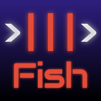
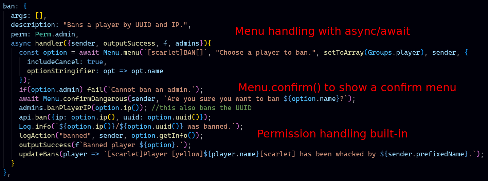

# Fish commands

A monolithic plugin that handles all custom features for the >|||>Fish servers. Created by Brandons404, rewritten by BalaM314.

**Before reading the code, see [docs/info.md](docs/info.md).**

## Features
* 95 in-game commands and 36 console commands
* Data syncing
* Automated moderation
* Cross-server chat
* Anti-impersonation
* Chat filtering
* Map management through a discord bot
* Map run tracking
* Visual effects
* Tile logs
----

Interested in contributing? See [CONTRIBUTING.md](CONTRIBUTING.md), and thanks in advance!

Contributors:

Join our Discord: [https://discord.gg/VpzcYSQ33Y](https://discord.gg/VpzcYSQ33Y)

